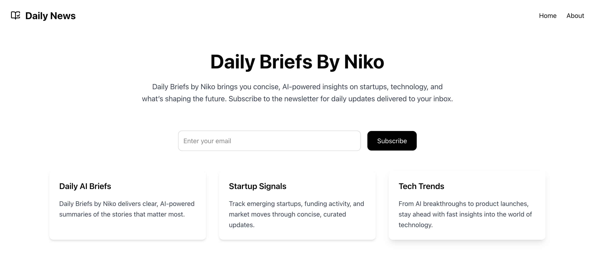
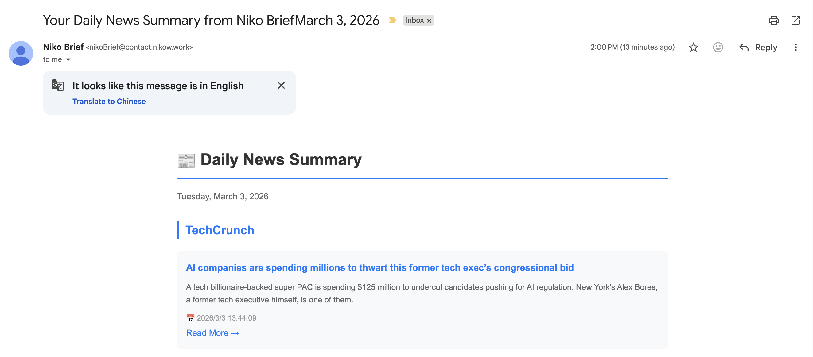

# Daily Briefs by Niko

A smarter way to stay informed — get concise updates on startups, technology, and the AI trends shaping the future.

## Preview

### Homepage


### Newsletter Email


---

## Tech Stack


---

## How It Works

1. **RSS feeds** are used to fetch news from multiple sources.
2. The news items are processed and formatted into a daily newsletter content
3. **Inngest** runs a scheduled workflow every day.
4. The workflow sends the formatted newsletter using **Resend**.
5. Users receive a concise daily brief directly in their inbox.

---

## Built With

- **Next.js** for the overall application framework
- **React** for building the UI
- **Tailwind CSS** for styling
- **Inngest** for scheduled background workflows
- **Resend** for email delivery and subscriber management
- **RSS Parser** for collecting news from external sources
- **Vercel** for deployment

---

## Getting Started

Make sure you are using **Node.js 20.9+**.

Clone the repository:

```bash
git clone https://github.com/NikoZW/niko-brief.git
cd niko-brief
```
Install dependencies:
```
npm install
```
Create a .env.local file in the root directory and add your environment variables:
```
RESEND_API_KEY=your_resend_api_key
```
Start the development server:
```
npm run dev
```
Open http://localhost:3000 in your browser.

